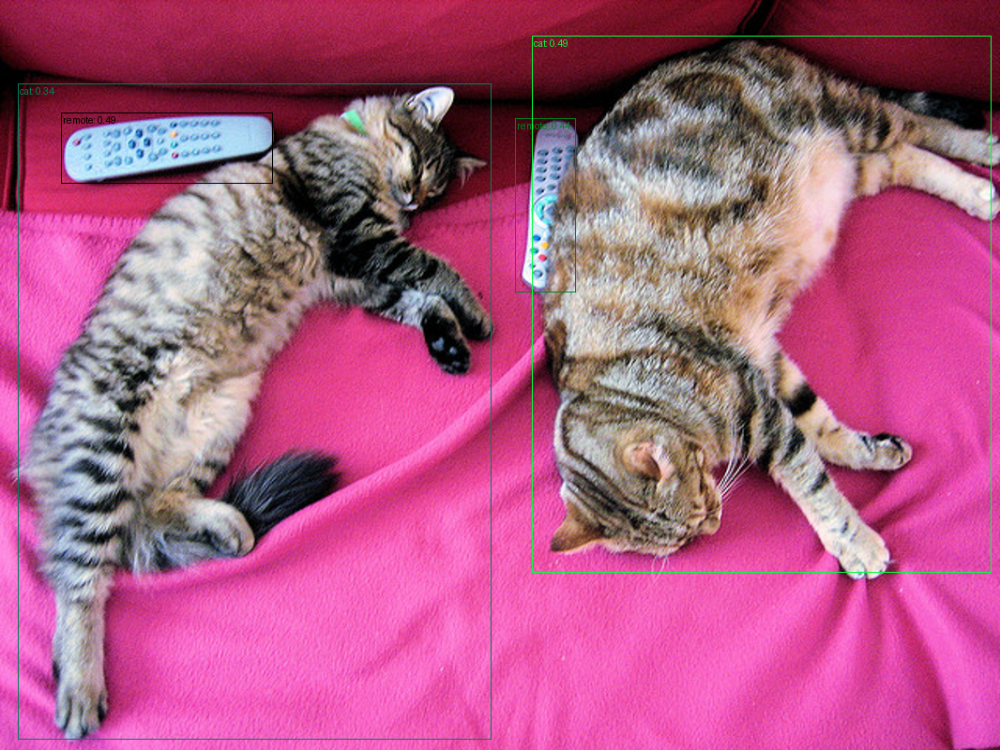

# Jurassic Open World

A model zoo for Grounding-DINO-based models.

Available models:
* `grounding_dino_tiny_idea` - model converted from original IDEA Research release
* `grounding_dino_base_idea` - model converted from original IDEA Research release
* `grounding_dino_tiny_idea_fscd147` - `grounding_dino_tiny_idea` finetuned on FSCD147 annotations
* `grounding_dino_tiny` - a more efficient version of `grounding_dino_tiny_idea`, initialized from `grounding_dino_tiny_idea` and finetuned on O365+GOLD-G (1.3M images)
* `grounding_dino_edge` - reimplementation of Grounding DINO 1.5 edge from IDEA research and trained on O365+GOLD-G (1.3M images)

Models are available on huggingface [in this collection](https://huggingface.co/collections/rziga/jurassic-open-world-68e246f58a5f0071faf19e46).

This repo also supports MM Grounding DINO weights and LLM-Det weights. Checkpoints for these will be released when I get the time.


## Installation

### By cloning the repo

Install with pip:
* `pip install -e .`

Install with uv:
* `uv sync`

### Directly with pip

Install with pip:
* `pip install git+https://github.com/rziga/jurassic-open-world.git`

Note that if you use this method, you can't evaluate and train the models, since these are located outside the package in the [`scripts`](scripts) folder.

### Install groups

There two dependency groups:
* `[custom-kernels]` - custom Triton implementation of multi scale deformable attention; recommended for systems that support Triton (allegedly does not work on Windows, but I can't test - works on my machine type shi)
* `[dev]` - for development

### Running the model

Best way to run the model is to use the provided predictor class:

```py
import requests
from PIL import Image

from jurassic_open_world.inference.predictor import GroundingDINOPredictor


predictor = GroundingDINOPredictor.from_pretrained(
    "rziga/grounding_dino_edge_jow", device="cuda:0"
)

url = "http://images.cocodataset.org/val2017/000000039769.jpg"
img = Image.open(requests.get(url, stream=True).raw).resize((1066, 800))
captions = ["cat", "remote"]

outputs, draw_img = (
    predictor
    .set_image(img)
    .set_text(captions)
    .predict(draw=True)
)
draw_img.show()
```


*Image source: [COCO](http://images.cocodataset.org/val2017/000000039769.jpg)*

## Training


### Data preparation

This project supports training with the ODVG or the standard COCO detection data format.

Read more about the ODVG format [here](https://github.com/longzw1997/Open-GroundingDino/blob/main/data_format.md). I converted the data for GOLD-G and O365 following this guide [here](https://github.com/open-mmlab/mmdetection/blob/main/configs/mm_grounding_dino/dataset_prepare.md).

Read more about the COCO format [here](https://roboflow.com/formats/coco-json).

Alternatively, you can implement your own dataset plugin, by adhering to the [`BaseDatasetPlugin`](src/jurassic_open_world/data/dataset_plugins/base.py).


### Training

Then you can train the model by using [`scripts/train.py`](scripts/train.py). You will need an appropriate model config, data config and training config. Examples of these are provided under [`configs`](configs).

Run the training with:
```sh
uv run scripts/train.py \
--data-config "configs/data/coco.yaml" \
--model-config "configs/model/grounding_dino_tiny_idea.yaml" \
--training-config "configs/training/finetune_1x.yaml"
```

For more info on these and other arguments run `uv run scripts/train.py --help`.

## Evaluation

This repo supports evaluation of COCO, LVIS and FSCD-147 datasets. To evaluate the model on a dataset run `uv run scripts/eval_{dataset}.py --help`.

## TODOs

There are a couple of things that need to be added:
* [ ] I need to upload MM Grounding DINO, LLM-Det and some other models to huggingface hub
* [ ] Some more clean-ups and docstrings
* [ ] Add other models (t-rex implementation) and training strategies like model distillation or PEFT (which I just str8 up deleted for this release LOL)

I am not unemployed anymore so I don't have a lot of free time (and to be honest I would rather just scroll short-form content than work on this most of the time) so these TODOs will be addressed when I feel like it. 

If you need to change something feel free to fork and add the feature yourself. I tried to make the code a bit cleaner than the original and left more comments, but it can still be improved. The config system for example is a bit overkill for this, but this is just cleaned up version of my masters thesis code, where I had to have a lot of flexibility to change the model in more significant ways (different encoders, query selectors, distillation training etc.), so it is what it is. 

Maybe if I find the motivation, I will make a separate repo with just a vanilla PyTorch training loop without the bells and whistles (probably not LOL).

## License

Apache 2.0, a copy is available in [LICENSE](LICENSE).

Original Grounding DINO weights are converted from their checkpoints which are available under Apache 2.0 [here](https://github.com/IDEA-Research/GroundingDINO).

Parts of test code is modified from transformers which is released under Apache 2.0 [here](https://github.com/huggingface/transformers).
